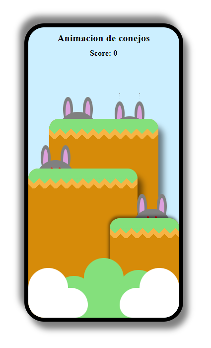

# ConejosAnimados
Creando una animación de conejos, donde cada vez
que le damos clic a uno, nos va a sumar en el 
conteo de arriba

<h1>Imagen de muestra:</h1>
<figure>
    </img>
</figure>
<a href="https://totimang.github.io/ConejosAnimados/">Link del sitio</a>